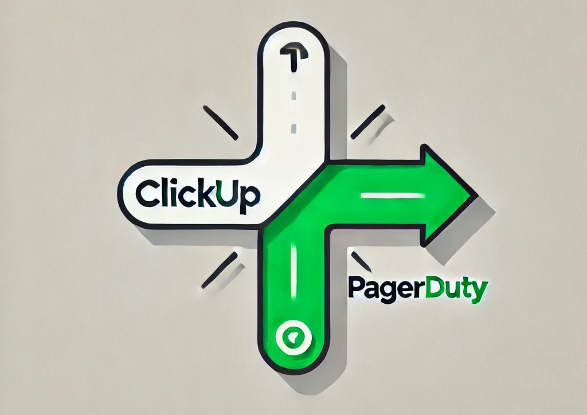

<p align="center">
  
</p>.

This app runs as a web service so that ClickUp can send webhook events that call the PagerDuty API.  It parses the events based on the `rules.yaml` and `groups.yaml`,
then alerts to PagerDuty (also based on the rules.griyos set in `rules.yaml`/`groups.yaml`)

`groups.yaml`
```
groups:
  - name: devops
    escalation_policy_id: XXXXXXX
  - name: engineering
    escalation_policy_id: XXXXXXX
  - name: support
    escalation_policy_id: XXXXXXX
```

`rules.yaml`
```
rules:
  - event: taskUpdated
    condition:
      key: priority
      value: urgent
    list: "DevOps List" # Filter by the ClickUp list name
    action: notifyPagerDuty
    group: devops # Route to the DevOps PagerDuty group/team based on condition and list

  - event: taskUpdated
    condition:
      key: status
      value: open
    space: "Engineering Space" # Filter by the ClickUp space name
    action: notifyPagerDuty
    group: engineering # Route to the Engineering PagerDuty group/team based on condition and space

  - event: taskCreated
    condition:
      key: priority
      value: high
    list: "Support List" # Filter by the ClickUp list name
    action: notifyPagerDuty
    group: support # Route to the Support PagerDuty group/team based on condition and list

```

Full parameter list:
| Env Name                     | Description                                                                       | Default Value  | Example                 |
|:-----------------------------|:----------------------------------------------------------------------------------|:---------------|:------------------------|
| PAGERDUTY_API_KEY            | Token used to talk to the PagerDuty API                                           | n/a            | u+rxxxxxxx              |
| PAGERDUTY_USER_EMAIL         | Some valid email associated to PagerDuty account                                  | n/a            | user@example.com        |
| PAGERDUTY_SERVICE_ID         | The PagerDuty service ID of the service integration created for ClickUp           | n/a            | 1234,platform-engineer  |

## PagerDuty Setup
You will need to create a Service Integration in PagerDuty and get an API key.  You will also need the ID related to service
integration and escalation policy.

## ClickUp Setup
You will need to use the ClickUp API to set up the Webhook endpoint for the list that you want to send events.  Be sure to read the
[ClickUp Webhook documentation](https://clickup.com/api/developer-portal/webhooks/) as there are limitations on specifying a webhook
per location.
```
curl --location 'https://api.clickup.com/api/v2/team/9999999/webhook' \
--header 'Authorization: <clickup api key>' \
--header 'Content-Type: application/json' \
--data '{
    "endpoint": "https://<your api url>/webhook?token=<sometoken>",
    "events": [
      "taskCreated",
      "taskUpdated",
      "taskPriorityUpdated"
    ],
    "space_id": 9999999999,
    "list_id": 9999999999999
  }'
  ```

## Build and Deploy with Dockerfile
```
docker buildx version
```

```
docker buildx create --use
docker buildx build --platform linux/amd64,linux/arm64 -t your-username/go-clickup-pagerduty-webhook:latest --push .

docker buildx build --platform linux/arm64 -t go-clickup-pagerduty-webhook:latest --load . // for local mac testing on arm64
```
